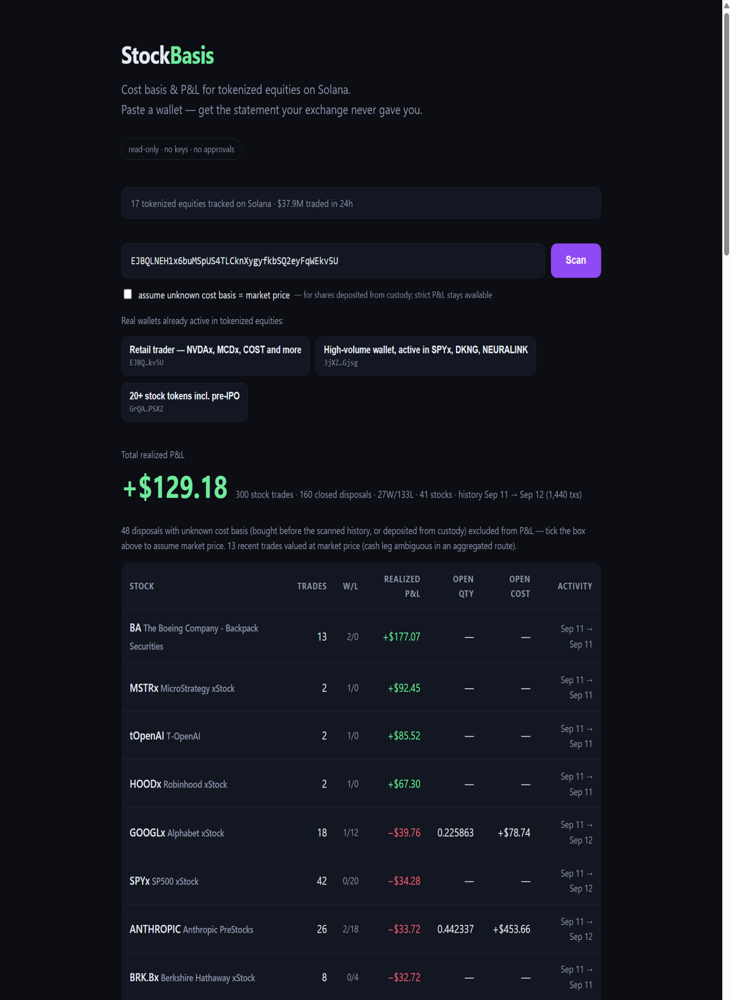

# StockBasis

Cost basis and P&L reports for tokenized equities on Solana.



Paste a wallet address → get a brokerage-style statement of your tokenized-stock
activity: every closing lot with its acquisition date, realized P&L, and a CSV
export you can hand to an accountant.

Live demo: https://stockbasis.tail88c821.ts.net

## Why

Tokenized stocks trade 24/7 on Solana — hundreds of small swaps per active month,
and no brokerage statement at the end of the year. Every holder hits this problem
personally: raw transaction histories are unreadable, and existing portfolio tools
treat these tokens like meme coins, not securities.

## How it works

The scanner walks the wallet's public transaction history, classifies every
tokenized-equity mint (xStocks, Backpack Securities, Ondo, PreStocks) by on-chain
token tags, reconstructs trades by diffing pre/post token balances, and computes
FIFO cost basis per lot.

Read-only by design: the tool never asks for keys, never requests approvals, and
never moves funds. There is no on-chain program because none is needed — on Solana
the entire trade history is publicly readable from one wallet scan, so the whole
product is a pure read-only computation. That is only possible here; on TradFi
rails the same report requires broker cooperation.

Disposals whose cost basis is unknowable from on-chain data (shares bought inside
a custodial app, then withdrawn) are excluded from the headline P&L rather than
invented; an optional toggle values them at market price, the usual convention
when basis is unknown.

## Who it is for

- **Tokenized-equity holders** (727k+ addresses and growing) who need a statement
  they can file or hand to an accountant.
- **Accountants and tax preparers** — the CSV follows the 1099-B shape:
  acquired date, sold date, proceeds, cost basis, gain per disposal.
- **Protocols and issuers** (Backpack Securities, PreStocks, xStocks) as embedded
  reporting: white-label the scanner behind an API.

Monetization follows the data: free single-wallet reports, paid API for portfolio
trackers and tax platforms, white-label statements for issuers who currently tell
their users "figure out your own taxes".

## Usage

Web UI (recommended):

```
npm run serve            # → http://localhost:8787
```

CLI:

```
node src/cli.mjs report  <address>    # terminal report
node src/cli.mjs csv     <address>    # per-disposal CSV (1099-B style)
node src/cli.mjs scan    <address>    # which equity tokens did the wallet touch
```

Env: `SOLANA_RPC` — comma-separated RPC endpoints (rotation on 429/5xx; defaults
include public mirrors); `INGEST_MAX_SCAN_TX`, `INGEST_TARGET_TRADES`,
`INGEST_CONCURRENCY`, `PORT`. Zero npm dependencies, Node ≥ 24.

## Status

Working end to end on mainnet. Known simplifications: address validation is a
base58 shape check; WSOL cash legs are priced per day; a new tokenized ticker
appears in reports as soon as Jupiter tags it, with a curated list as fallback.

## Tests

`npm test` — 21 cases covering the FIFO engine (unit, randomized property tests
against an independent implementation), transaction reconstruction (real mainnet
fixtures, multi-account edge cases) and CSV output.

## License

MIT
